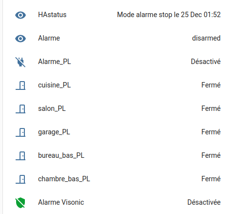

# Interface of the visonic alarm using a powerlink2 with Home Assistant

**based on an initial version by bertbert72, modified by mbuffat**

1. correction for new HA version: (as pointed by Ptrick Fulcheri)

 remove hass.async_create_task and replace by hass.create_task

2. remove config in configuration.yaml 

## Powerlink2

create sensor and binary_sensor to interact with a visonic alarm using the mqtt protocol

### installation

you can use HACS and install as a custom component, or download and 
copy the custom_compents/powerlink2 to your home_assistant custom_components directory

#### configuration of home assistant

- in the configuration.yaml file, define the control panel to control the alarm

attention: useless for the new version of HA !!

```
alarm_control_panel:
  - platform: mqtt
    state_topic: homeassistant/alarm
    command_topic: homeassistant/alarm/set
    payload_disarm: Disarm
    payload_arm_home: ArmHome
    payload_arm_away: ArmAway
    name: Alarme Visonic

```

- in the sensors.yaml file (in the configuration.yaml I use `sensor: !include sensors.yaml`) insert the configuration of the powerlink2 sensor as

```
  - platform: powerlink2
    state_topic: homeassistant/alarm
    command_topic: homeassistant/alarm/set
    sensor_topic: homeassistant/alarm/sensor
    sensor_battery_topic: homeassistant/alarm/sensorbattery
    host: !secret alarm_host
    scan_interval: 1
    ignore_first_cmd: True
    alarm_user: !secret alarm_user
    alarm_password: !secret alarm_password
    powerlink_lang: EN
```

currently support french "FR" or english "EN" for the powerlink2 interface.

- in the mqtt.yaml file (in the configuration.yaml I use `mqtt: !include mqtt.yaml`) insert the mqtt sensors you want to use

```
# mqtt sensor
  sensor:
    - name: HAstatus 
      state_topic: "homeassistant/status"
    - name: Alarme
      state_topic: "homeassistant/alarm"
    - name: AlarmSensor 
      state_topic: "homeassistant/alarm/sensor"
# mqtt binary_sensor
  binary_sensor:
    - name: Alarme_PL
      state_topic: "homeassistant/alarm"
      payload_on: "armed_away"
      payload_off: "disarmed" 
      device_class: power 
    - name: cuisine_PL
      state_topic: "homeassistant/alarm/sensor5"
      payload_on: "Ouv."
      payload_off: "Ok"
      device_class: door
    - name: salon_PL
      state_topic: "homeassistant/alarm/sensor6"
      payload_on: "Ouv."
      payload_off: "Ok"
      device_class: door 
```

The following image show an example of the visonic2 interface on home-assistant




## HomeAssistant_Powerlink : initial version by  bertbert72 

 - https://github.com/bertbert72/HomeAssistant_Powerlink


Powerlink platform for use with Home Assistant and the MQTT alarm component.

Requires an MQTT broker to be installed and configured.  Sensors can then be created to monitor the alarm, as well as turning it on/off.  Example config:

```
alarm_control_panel:
  - platform: mqtt
    state_topic: home/alarm
    command_topic: home/alarm/set
    payload_disarm: Disarm
    payload_arm_home: ArmHome
    payload_arm_away: ArmAway
    name: House Alarm

sensor:
  - platform: powerlink2
    state_topic: home/alarm
    command_topic: home/alarm/set
    sensor_topic: home/alarm/sensor
    sensor_battery_topic: home/alarm/sensorbattery
    host: !secret alarm_host
    scan_interval: 1
    ignore_first_cmd: True
    alarm_user: !secret alarm_user
    alarm_password: !secret alarm_password

binary_sensor:
  - platform: mqtt
    state_topic: "home/alarm/sensor1"
    payload_on: Open
    payload_off: Ok
    device_class: door
    name: Front Door
  - platform: mqtt
    state_topic: "home/alarm/sensor2"
    payload_on: Open
    payload_off: Ok
    device_class: motion
    name: Downstairs
  - platform: mqtt
    state_topic: "home/alarm/sensor3"
    payload_on: Open
    payload_off: Ok
    device_class: motion
    name: Kitchen
  - platform: mqtt
    state_topic: "home/alarm/sensor4"
    payload_on: Open
    payload_off: Ok
    device_class: door
    name: Patio Doors
  - platform: mqtt
    state_topic: "home/alarm/sensor5"
    payload_on: Open
    payload_off: Ok
    device_class: motion
    name: Upstairs
  - platform: mqtt
    state_topic: "home/alarm/sensor6"
    payload_on: Open
    payload_off: Ok
    device_class: door
    name: Back Door
  - platform: mqtt
    state_topic: "home/alarm/sensorbattery1"
    payload_on: Low
    payload_off: Ok
    device_class: battery
    name: Front Door Battery
  - platform: mqtt
    state_topic: "home/alarm/sensorbattery2"
    payload_on: Low
    payload_off: Ok
    device_class: battery
    name: Downstairs Battery
  - platform: mqtt
    state_topic: "home/alarm/sensorbattery3"
    payload_on: Low
    payload_off: Ok
    device_class: battery
    name: Kitchen Battery
  - platform: mqtt
    state_topic: "home/alarm/sensorbattery4"
    payload_on: Low
    payload_off: Ok
    device_class: battery
    name: Patio Doors Battery
  - platform: mqtt
    state_topic: "home/alarm/sensorbattery5"
    payload_on: Low
    payload_off: Ok
    device_class: battery
    name: Upstairs Battery
  - platform: mqtt
    state_topic: "home/alarm/sensorbattery6"
    payload_on: Low
    payload_off: Ok
    device_class: battery
    name: Back Door Battery
```
